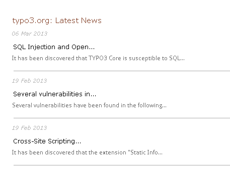

.. ==================================================
.. FOR YOUR INFORMATION
.. --------------------------------------------------
.. -*- coding: utf-8 -*- with BOM.

.. include:: ../Includes.txt

What does it do?
================

This extension imports rss news items from external rss feeds. This extension does not import anything into the database and it only displays the rss news articles in front end. This extension works in TYPO3 6.2.0 - 8.9.99

	Fronted view

