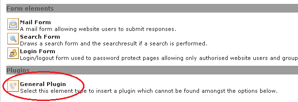
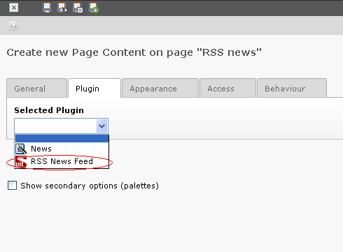

.. ==================================================
.. FOR YOUR INFORMATION
.. --------------------------------------------------
.. -*- coding: utf-8 -*- with BOM.

.. include:: ../Includes.txt

.. _users-manual:

Users manual
============
To display RSS News Feed on a page:

Create a new content element “General Plugin”.

Target group: **Users**

If you want to add header, please add and goto the tab “Plugin”. Select the plugin RSS News Feed from the list.

.. toctree::
	:maxdepth: 2
	:titlesonly:
	:glob:

	Introduction/Index
	UsersManual/Index
	RssOption/Index
