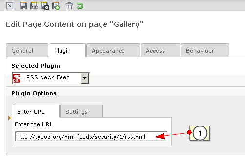
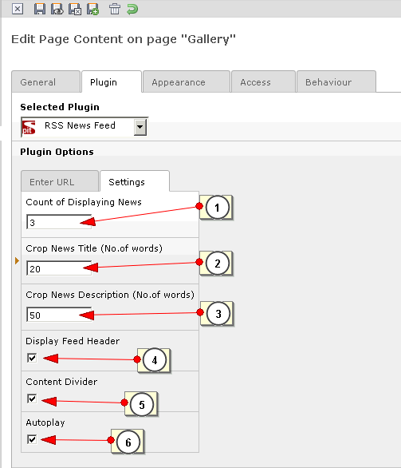

.. ==================================================
.. FOR YOUR INFORMATION
.. --------------------------------------------------
.. -*- coding: utf-8 -*- with BOM.

.. include:: ../Includes.txt

.. _rss-options:

Rss Options
============

After selecting the plugin you have several options to give details of RSS feed. See the below screen for RSS flexform options.

There are mainly two tabs : i) Enter the URL & ii) Settings

i) Enter the URL
^^^^^^^^^^^^^^^^^

1. Enter the RSS url here. Note that please put a valid rss url.Some RSS URLs are mentined here for reference;

a. http://feeds.feedburner.com/cnet/tcoc

b. http://news.nationalgeographic.com/index.rss

ii) Settings
^^^^^^^^^^^^^

1. Enter the number of news items to be displayed (It must be greater than 0). This is a mandatory field. You must enter a news item count here.

2. If you want to crop the title characters, please enter the number of characters in the box (It must be greater than 0).

3. If you want to crop the description, enter the number of characters here (It must be greater than 0).

4. For displaying RSS feed headers, tick this check box.

5. If you want to seperate news items using a ruler, please tick this.

6. For auto scrolling of news items, please tick this.

